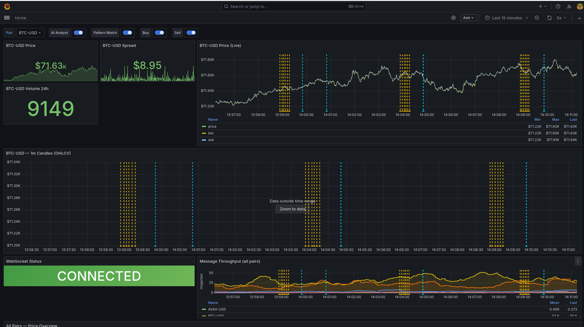
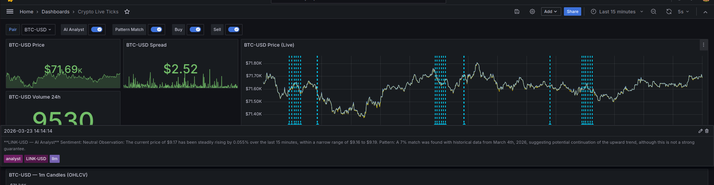
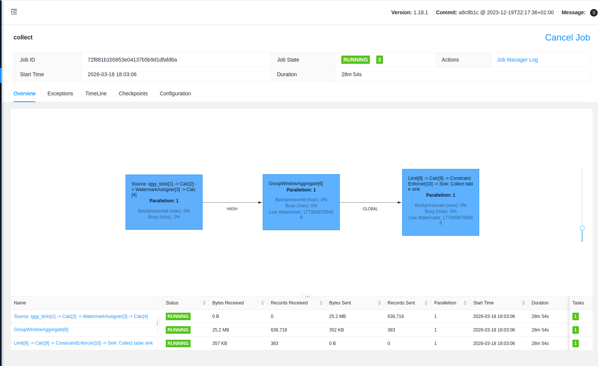
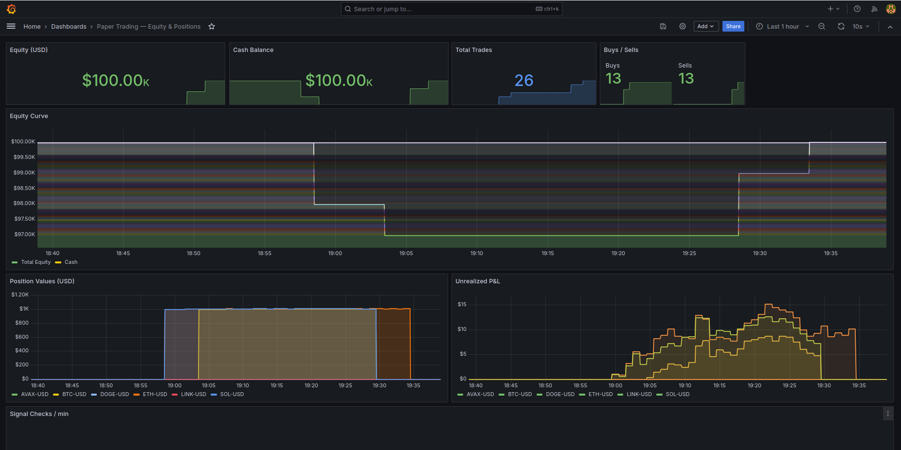

# Streaming Lakehouse Reference

A streaming data platform processing live crypto ticks through six tiers
with no traditional database.

**No real money. Real data. Real architecture.**

---

## What This Is

A platform for watching cryptocurrency markets, simulating trading decisions
(paper trading), and learning modern data engineering technologies through
hands-on use with data you actually care about.

The project is built in deliberate phases — each phase introduces one new
technology, leaves the system in a working state, and teaches something real.

---

## What This Is Not

- A financial trading platform
- Investment advice
- Production software

---

## The Stack (as built)

### Data Source
- **Coinbase Exchange WebSocket** — real-time sub-second ticker data (BTC, ETH, SOL, DOGE, AVAX, LINK)

### Event Infrastructure (Phase 2)
- **Apache Iggy** — Rust-native event bus, 3-partition `crypto/prices` topic
- **Custom Flink Connector** — [flink-connector-iggy](https://github.com/gordonmurray/flink-connector-iggy), built from scratch for Flink 1.18–1.20

### Stream Processing (Phase 3)
- **Apache Flink 1.20.3** — OHLCV candle computation via Flink SQL, 8 task slots
- **ZooKeeper 3.9** — coordination (used by Fluss, available for Flink HA)

### Hot SQL Tier (Phase 4)
- **Apache Fluss 0.9.0** — real-time streaming storage, sub-second SQL queries
- **Pipeline throughput**: ~12,000 records/sec Iggy → Flink → Fluss

### Tiered Lakehouse (Phase 5)
- **Apache Paimon 1.3.1** — warm tier, 1-min OHLCV candles (append-only, 4 buckets, parquet+zstd)
- **Apache Iceberg 1.10.1** — cold tier, raw tick archive (identity-partitioned by date, parquet+zstd)
- **Hadoop 3.3.6** — filesystem client for Iceberg reads
- Flink STATEMENT SET fans Iggy source to both sinks in a single job

### Historical Replay (Phase 6)
- **Replay Service** — reads Iceberg cold tier via PyArrow, replays to Iggy at configurable speed (default 60x)
- Separate Flink pipeline computes replay candles into Paimon `replay_ohlcv_1m`
- On-demand via Docker Compose profiles: `docker compose --profile replay up replay`

### Vector Pattern Matching (Phase 7)
- **LanceDB 0.30** — 16k+ searchable price pattern vectors (1-hour sliding windows, Z-score normalized)
- **Lancer** service — dual-mode: batch indexer (Paimon → LanceDB) + live signal matcher (Iggy → LanceDB → Grafana annotations)
- **FastAPI** — `GET /api/signals/{pair}` returns top-5 historical matches with similarity scores

### LLM Analyst (Phase 8)
- **Ollama** (host) — Llama 3 8B (`mannix/llama3-8b-ablitered-v3`), CPU inference (~3s per pair)
- **Analyst Service** — RAG-style: gathers price trends from Prometheus + pattern matches from Lancer, builds prompt, calls Ollama, pushes structured narrative as Grafana annotations every 5 minutes
- **FastAPI** — `GET /api/latest/{pair}` returns current AI narrative

### Paper Trading Engine (Phase 10)
- **Consensus Engine** — polls Lancer (similarity) + Analyst (sentiment), executes when signals align (enter >= 20% similarity + Bullish, exit < 10% or Bearish)
- **Flink Clearing House** — processes OrderRequests from Iggy, applies 0.1% fees + 0.05% slippage, writes to Paimon (trades + balance) and Fluss (executed trades)
- **Paimon Ledger** — PK tables: `balance` (aggregation merge engine) + `trades` (deduplicate). Zero traditional databases.
- **DuckDB Audit** — `GET /api/audit` queries Paimon parquet files for strategy P&L, win rate, fee impact

### Monitoring (Phase 1)
- **Prometheus** — scrapes poller, bridge, Flink, replay, lancer, and analyst metrics
- **Grafana** — five dashboards: Crypto Live Ticks (with AI + trade annotations), Flink Pipeline, Historical Replay, Lancer Pattern Matcher, Paper Trading Equity

---

## Architecture

```
Coinbase WebSocket
       │
       ▼
    Poller (Python)
       │
       ▼
    Apache Iggy ──────► Bridge (Python) ──► Prometheus ──► Grafana
       │                                        ▲
       ▼                                        │
    Apache Flink ──► Apache Fluss          Flink Metrics
       │                                   (port 9249)
       ├──► Apache Paimon  (warm: 1-min OHLCV candles)
       └──► Apache Iceberg (cold: raw tick archive)
                │
                ▼
           Replay Service (Python) ──► Iggy crypto/replay ──► Flink ──► Paimon

    Apache Paimon ──► Lancer Indexer ──► LanceDB (16k+ pattern vectors)
    Apache Iggy   ──► Lancer Signal  ──► LanceDB query ──► Grafana Annotations
                                     └──► FastAPI /api/signals/{pair}

    Prometheus (trends) ──┐
                          ├──► Analyst ──► Ollama (Llama 3) ──► Grafana Annotations
    Lancer (matches)  ────┘                                └──► FastAPI /api/latest
```

---

## Screenshots

### Crypto Live Ticks — real-time price, OHLCV candles, WebSocket status


### AI Analyst annotation — LLM-generated market commentary on the price chart


### Flink job graph — streaming pipeline processing live ticks


### Paper Trading — equity curve, positions, and P&L tracking


---

## Services

| Service | Image | Port | Purpose |
|---|---|---|---|
| iggy | `apache/iggy:0.7.0` | 3000, 8090 | Event spine (TCP + HTTP) |
| iggy-web-ui | `apache/iggy-web-ui:0.2.0` | 8888 | Iggy management UI |
| poller | Custom Python | 8000 | Coinbase WebSocket → Iggy |
| bridge | Custom Python | 8001 | Iggy → Prometheus metrics |
| zookeeper | `zookeeper:3.9` | 2181 | Coordination for Fluss |
| jobmanager | Custom Flink 1.20.3 (`flink/Dockerfile`) | 8081 | Flink JobManager + SQL client |
| taskmanager | Custom Flink 1.20.3 (`flink/Dockerfile`) | 9249 | Flink TaskManager + Prometheus metrics |
| fluss-coordinator | `apache/fluss:0.9.0-incubating` | 9123 | Fluss metadata + coordination |
| fluss-tablet | `apache/fluss:0.9.0-incubating` | 9124 | Fluss data storage |
| prometheus | `prom/prometheus:v2.53.0` | 9090 | Metrics collection |
| grafana | `grafana/grafana:11.1.0` | 3001 | Dashboards |
| replay | Custom Python (profiles: replay) | 8002 | Iceberg → Iggy historical replay |
| lancer-indexer | Custom Python (profiles: index) | — | Paimon → LanceDB pattern index |
| lancer | Custom Python | 8003, 8004 | Live pattern matcher (API + metrics) |
| analyst | Custom Python (network_mode: host) | 8005, 8006 | LLM market commentary (API + metrics) |
| consensus | Custom Python (network_mode: host) | 8007, 8008 | Paper trading engine (API + metrics) |

---

## Quick Start (first time)

```bash
git clone <repo>
cd streaming-lakehouse-reference
cp .env.example .env

# Download connector JARs (~250 MB, verified with SHA-256 checksums)
./scripts/download-jars.sh

docker compose up -d
```

Then submit the Flink jobs and seed the balance (see "After a Reboot" below).

### Web UIs

- **Grafana**: http://localhost:3001 (admin / admin)
- **Flink UI**: http://localhost:8081
- **Iggy Web UI**: http://localhost:8888/dashboard
- **Prometheus**: http://localhost:9090

---

## After a Reboot

Docker containers restart automatically (`restart: unless-stopped`), but **Flink SQL jobs do not survive restarts** — they must be resubmitted. Iggy topics are also recreated by the Python services on startup, but the **Flink jobs must be submitted after the topics exist**.

### Step 1: Start all containers

```bash
docker compose up -d
```

### Step 2: Ensure Ollama is running on the host

```bash
ollama serve &  # if not already running as a systemd service
```

### Step 3: Submit Flink SQL jobs (order matters)

Wait ~30 seconds after `docker compose up` for Iggy and Fluss to be healthy, then:

```bash
# Fluss hot tier (reads from Iggy crypto/prices → Fluss)
docker exec -i jobmanager /opt/flink/bin/sql-client.sh embedded < flink/sql/fluss-hot-tier.sql

# Lakehouse tier (reads from Iggy crypto/prices → Paimon + Iceberg)
docker exec -i jobmanager /opt/flink/bin/sql-client.sh embedded < flink/sql/lakehouse-tier.sql

# Clearing house (reads from Iggy crypto/orders → Paimon + Fluss)
# NOTE: The consensus engine must start first to create the crypto/orders topic.
#        Wait a few seconds after containers are up, then submit:
docker exec -i jobmanager /opt/flink/bin/sql-client.sh embedded < flink/sql/clearing-house.sql
```

### Step 4: Verify

```bash
# Check all 3 Flink jobs are RUNNING
curl -s http://localhost:8081/jobs | python3 -c "import sys,json; [print(j['id'][:12], j['status']) for j in json.load(sys.stdin)['jobs'] if j['status']=='RUNNING']"

# Check APIs
curl -s http://localhost:8007/api/health  # consensus
curl -s http://localhost:8005/api/health  # analyst
curl -s http://localhost:8003/api/health  # lancer
```

### What resets on reboot

| Component | Persists? | Notes |
|-----------|-----------|-------|
| Iggy topics | No | Recreated automatically by poller/consensus on startup |
| Iggy messages | No | Historical messages lost; new ticks flow immediately |
| Flink jobs | No | Must resubmit SQL files (see above) |
| Paimon data | Yes | Docker volume `flink-warehouse` persists |
| Iceberg data | Yes | Docker volume `flink-warehouse` persists |
| LanceDB index | Yes | Stored at `./data/lancedb/` |
| Paimon balance | Yes | Seeded once; persists across restarts |
| Consensus positions | No | In-memory; resets to $1K cash, no positions |
| Grafana dashboards | Yes | Provisioned from files |
| Prometheus data | Yes | Stored at `./data/prometheus/` (7-day retention) |

### Seed balance (first time only)

Only needed once. If `paimon.crypto.balance` already has data, skip this:

```bash
docker exec -i jobmanager /opt/flink/bin/sql-client.sh embedded < flink/sql/seed-balance.sql
```

---

## Optional Operations

### Re-index Lancer (after adding new pairs or accumulating more data)

```bash
docker compose --profile index run --rm lancer-indexer
```

### Replay historical data

```bash
docker compose --profile replay up replay -d
docker exec -i jobmanager /opt/flink/bin/sql-client.sh embedded < flink/sql/replay-pipeline.sql
```

Configure via `.env`: `REPLAY_SPEED`, `REPLAY_DATE`, `REPLAY_PAIRS`.

### Run the OHLCV candle query (interactive)

```bash
docker exec -i jobmanager /opt/flink/bin/sql-client.sh embedded < flink/sql/ohlcv-candles.sql
```

---

## Build Phases

| Phase | What It Adds | Status |
|---|---|---|
| 1 | Live crypto price dashboard (Prometheus + Grafana) | Complete |
| 2 | Iggy event spine + MCP | Complete |
| 3 | Flink stream processing + OHLCV candles | Complete |
| 4 | Fluss hot SQL tier + Grafana pipeline dashboard | Complete |
| 5 | Tiered lakehouse (Paimon + Iceberg) | Complete |
| 6 | Historical replay (Iceberg → Iggy → Flink → Paimon) | Complete |
| 7 | LanceDB vector pattern matching (Lancer) | Complete |
| 8 | LLM Analyst (Grafana-native, Ollama) | Complete |
| 9 | Multi-pair expansion + dynamic dashboards | Complete |
| 10 | Lakehouse execution engine (paper trading) | Complete |

Each phase introduces one new technology, leaves the system working, and teaches something real.

---

## Grafana Dashboards

All dashboards at http://localhost:3001 (admin / admin).

| Dashboard | URL | Tags | What It Shows |
|---|---|---|---|
| Crypto Live Ticks | `/d/crypto-live-ticks` | hot, live | Price/bid/ask chart per pair (dropdown selector), all-pairs overview, WebSocket status, message throughput |
| Flink Pipeline | `/d/flink-pipeline` | hot, streaming, flink | Records/sec and bytes/sec into Fluss, total records written |
| Historical Replay | `/d/replay` | cold, replay, iceberg | Replay progress, throughput, records sent vs total, Flink pipeline in/out |
| Lancer — Pattern Matcher | `/d/lancer` | data, vectors, lancedb | Top similarity score, index size, candle buffer fill, queries run, annotations pushed |
| Paper Trading | `/d/trading` | hot, trading, execution | Equity curve, cash balance, position values, unrealized P&L, buys/sells count, signal checks |

### Annotations on Live Ticks

The Crypto Live Ticks dashboard displays four annotation layers (toggleable):

| Colour | Source | Content |
|---|---|---|
| Yellow | AI Analyst | LLM market commentary — sentiment, observation, pattern context (every 5 min) |
| Cyan | Lancer | Pattern match alerts when similarity exceeds threshold |
| Green | Consensus Engine | **BUY** trades — pair, price, quantity, value |
| Red | Consensus Engine | **SELL** trades — pair, price, quantity, value |

Hover over any annotation line on the chart to see the full detail.

---

## APIs

| Service | Endpoint | Description |
|---|---|---|
| Lancer | `GET http://localhost:8003/api/signals/{pair}` | Top-5 historical pattern matches with similarity scores |
| Lancer | `GET http://localhost:8003/api/health` | Index status |
| Analyst | `GET http://localhost:8005/api/latest` | Current LLM narratives for all pairs |
| Analyst | `GET http://localhost:8005/api/latest/{pair}` | Current narrative for a specific pair |
| Consensus | `GET http://localhost:8007/api/positions` | Cash balance and open positions |
| Consensus | `GET http://localhost:8007/api/trades` | Last 50 executed trades with price, quantity, signals |
| Consensus | `GET http://localhost:8007/api/audit` | DuckDB strategy audit — P&L, total fees, trade count |
| Consensus | `GET http://localhost:8007/api/health` | Engine status, tracked pairs, cash balance |

---

## Coins Monitored

| Symbol | Name |
|---|---|
| BTC | Bitcoin |
| ETH | Ethereum |
| SOL | Solana |
| DOGE | Dogecoin |
| AVAX | Avalanche |
| LINK | Chainlink |

---

## Project Conventions

- All services run via Docker Compose
- All config via `.env` — never hardcoded
- One phase at a time — commit before starting the next

---

## Data Source

Prices are sourced from the **Coinbase Exchange Public WebSocket**
(`wss://ws-feed.exchange.coinbase.com`). Real-time, sub-second ticker data.
No authentication or API keys required for public market data.

---

## More Info

- [architecture.md](architecture.md) — full system design and component details
- [docs/clean-slate-guide.md](docs/clean-slate-guide.md) — full reset with 6-month historical backfill
